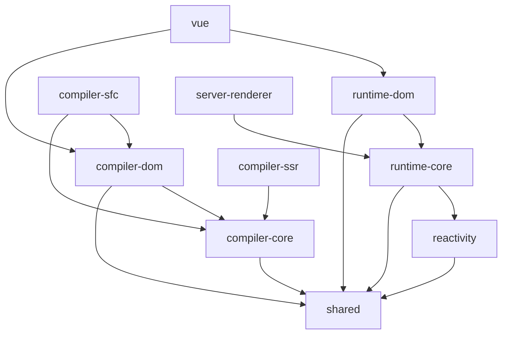

# 第1章：Vue3整体架构概览

## 🎯 本章学习目标

- 理解Vue3的诞生背景和设计目标
- 掌握Vue3的Monorepo架构设计
- 了解Vue3的核心设计理念
- 理解Vue3与Vue2的本质差异
- 建立Vue3整体学习框架

## 1.1 Vue3的诞生背景

### 1.1.1 Vue2的痛点分析

Vue2在大型应用中暴露出的问题：

**1. 响应式系统性能瓶颈**

```javascript
// Vue2中的响应式实现限制
Object.defineProperty(obj, 'key', {
  get() {
    // 只能监听已存在的属性
    return val
  },
  set(newVal) {
    // 无法监听属性的添加和删除
    val = newVal
  }
})

// 导致的问题：
// 1. 无法检测对象属性的添加或删除
// 2. 无法直接监听数组索引和length的变化
// 3. 需要深度遍历对象的所有属性
```

**2. TypeScript支持不佳**

```javascript
// Vue2 Options API的类型推导困难
export default {
  data() {
    return {
      message: 'Hello' // 类型推导困难
    }
  },
  computed: {
    // this的类型推导复杂
    upperMessage() {
      return this.message.toUpperCase()
    }
  }
}
```

**3. 逻辑复用困难**

```javascript
// Mixin方式的问题
const mousePositionMixin = {
  data() {
    return {
      x: 0,
      y: 0
    }
  },
  mounted() {
    window.addEventListener('mousemove', this.update)
  },
  methods: {
    update(e) {
      this.x = e.pageX
      this.y = e.pageY
    }
  }
}

// 问题：
// 1. 命名冲突风险
// 2. 数据来源不清晰
// 3. 难以追踪和调试
```

### 1.1.2 Vue3的设计目标

**更好的性能**
- 重写响应式系统：Proxy代替Object.defineProperty
- 编译时优化：静态提升、补丁标记等
- 更高效的diff算法

**更强的TypeScript支持**
- 从设计之初就考虑类型系统
- Composition API提供更好的类型推导
- 全面的类型定义

**更好的逻辑复用**
- Composition API解决逻辑组织问题
- 更灵活的代码组织方式
- 消除Mixin的弊端

**更小的包体积**
- 支持Tree-shaking
- 按需引入功能模块
- 更好的代码分割

## 1.2 Monorepo架构解析

### 1.2.1 整体架构图

```
Vue3 Core Repository
├── packages/
│   ├── reactivity/           # 响应式系统 (独立包)
│   ├── runtime-core/         # 运行时核心 (平台无关)
│   ├── runtime-dom/          # DOM运行时 (Web平台)
│   ├── compiler-core/        # 编译器核心 (平台无关)
│   ├── compiler-dom/         # DOM编译器 (Web平台)
│   ├── compiler-sfc/         # 单文件组件编译器
│   ├── compiler-ssr/         # SSR编译器
│   ├── server-renderer/      # 服务端渲染
│   ├── shared/               # 共享工具函数
│   └── vue/                  # 完整版入口
└── scripts/                  # 构建脚本
```

### 1.2.2 核心包详细职责

**@vue/reactivity - 响应式系统**
```typescript
// 独立的响应式系统，可脱离Vue使用
import { reactive, computed, effect } from '@vue/reactivity'

const state = reactive({ count: 0 })
const doubled = computed(() => state.count * 2)

effect(() => {
  console.log('count is:', state.count)
})

state.count++ // 触发effect执行
```

**@vue/runtime-core - 运行时核心**
```typescript
// 平台无关的运行时核心
export interface RendererOptions<HostNode, HostElement> {
  createElement(type: string): HostElement
  createText(text: string): HostNode
  setText(node: HostNode, text: string): void
  setElementText(el: HostElement, text: string): void
  insert(child: HostNode, parent: HostElement, anchor?: HostNode): void
  remove(child: HostNode): void
  // ... 更多平台相关的操作
}

// 创建渲染器
function createRenderer<HostNode, HostElement>(
  options: RendererOptions<HostNode, HostElement>
) {
  // 返回平台无关的渲染器
}
```

**@vue/runtime-dom - DOM运行时**
```typescript
// Web平台特定的实现
import { createRenderer } from '@vue/runtime-core'

const rendererOptions = {
  createElement(tag: string): Element {
    return document.createElement(tag)
  },
  createText(text: string): Text {
    return document.createTextNode(text)
  },
  setText(node: Text, text: string): void {
    node.nodeValue = text
  },
  setElementText(el: Element, text: string): void {
    el.textContent = text
  },
  insert(child: Node, parent: Element, anchor?: Node): void {
    parent.insertBefore(child, anchor || null)
  },
  remove(child: Node): void {
    const parent = child.parentNode
    if (parent) {
      parent.removeChild(child)
    }
  }
  // ... 更多DOM操作
}

export const { render, createApp } = createRenderer(rendererOptions)
```

### 1.2.3 包之间的依赖关系



## 1.3 Vue3的核心设计理念

### 1.3.1 组合式API (Composition API)

**设计动机**：
- 更好的逻辑复用
- 更强的TypeScript支持
- 更灵活的代码组织

**核心概念对比**：

```vue
<!-- Options API (Vue2风格) -->
<template>
  <div>
    <p>Count: {{ count }}</p>
    <p>Double: {{ doubleCount }}</p>
    <button @click="increment">+</button>
  </div>
</template>

<script>
export default {
  data() {
    return {
      count: 0
    }
  },
  computed: {
    doubleCount() {
      return this.count * 2
    }
  },
  methods: {
    increment() {
      this.count++
    }
  },
  mounted() {
    console.log('组件已挂载')
  }
}
</script>
```

```vue
<!-- Composition API (Vue3风格) -->
<template>
  <div>
    <p>Count: {{ count }}</p>
    <p>Double: {{ doubleCount }}</p>
    <button @click="increment">+</button>
  </div>
</template>

<script setup lang="ts">
import { ref, computed, onMounted } from 'vue'

// 响应式状态
const count = ref<number>(0)

// 计算属性
const doubleCount = computed(() => count.value * 2)

// 方法
const increment = (): void => {
  count.value++
}

// 生命周期
onMounted(() => {
  console.log('组件已挂载')
})
</script>
```

**逻辑复用对比**：

```typescript
// Vue2 Mixin方式
const counterMixin = {
  data() {
    return { count: 0 }
  },
  methods: {
    increment() { this.count++ }
  }
}

// Vue3 Composable方式
function useCounter(initialValue = 0) {
  const count = ref(initialValue)
  
  const increment = () => {
    count.value++
  }
  
  const decrement = () => {
    count.value--
  }
  
  return {
    count: readonly(count),
    increment,
    decrement
  }
}

// 使用
const { count, increment, decrement } = useCounter(10)
```

### 1.3.2 Tree-shaking友好设计

**Vue2的全局API问题**：
```javascript
// Vue2: 所有API都挂载在Vue构造函数上
import Vue from 'vue'

Vue.nextTick(() => {})
Vue.observable({})
Vue.version

// 问题：无法Tree-shake，所有API都会被打包
```

**Vue3的按需导入**：
```javascript
// Vue3: 所有API都可以按需导入
import { nextTick, reactive, ref, computed } from 'vue'

nextTick(() => {})
const state = reactive({})

// 只有使用的API会被打包
```

### 1.3.3 更好的TypeScript支持

**类型推导示例**：
```typescript
import { ref, computed, reactive } from 'vue'

// 自动类型推导
const count = ref(0)              // Ref<number>
const message = ref('hello')      // Ref<string>
const doubled = computed(() => count.value * 2)  // ComputedRef<number>

// 复杂类型
interface User {
  id: number
  name: string
  email: string
}

const user = reactive<User>({
  id: 1,
  name: 'John',
  email: 'john@example.com'
})

// 类型推导和检查
const getUserInfo = computed(() => {
  return `${user.name} (${user.email})`  // 完全的类型安全
})
```

## 1.4 Vue3的编译策略

### 1.4.1 编译时优化

**静态提升(Static Hoisting)**：
```javascript
// 编译前
<div>
  <p>静态内容</p>
  <p>{{ message }}</p>
</div>

// 编译后
const _hoisted_1 = createElementVNode("p", null, "静态内容")

function render() {
  return createElementVNode("div", null, [
    _hoisted_1,  // 静态节点被提升，避免重复创建
    createElementVNode("p", null, toDisplayString(message))
  ])
}
```

**补丁标记(Patch Flags)**：
```javascript
// 编译前
<div :class="className">{{ message }}</div>

// 编译后
createElementVNode("div", {
  class: className
}, toDisplayString(message), 3 /* TEXT | CLASS */)

// PatchFlags枚举
const enum PatchFlags {
  TEXT = 1,           // 文本内容变化
  CLASS = 1 << 1,     // class变化
  STYLE = 1 << 2,     // style变化
  PROPS = 1 << 3,     // 除了class/style的其他props
  // ...
}
```

### 1.4.2 运行时优化

**更高效的响应式系统**：
```typescript
// Vue3使用Proxy实现响应式
const reactiveHandler = {
  get(target, key, receiver) {
    // 依赖收集
    track(target, 'get', key)
    return Reflect.get(target, key, receiver)
  },
  set(target, key, value, receiver) {
    const result = Reflect.set(target, key, value, receiver)
    // 触发更新
    trigger(target, 'set', key, value)
    return result
  }
}

function reactive(target) {
  return new Proxy(target, reactiveHandler)
}
```

## 1.5 与Vue2的核心差异对比

### 1.5.1 详细对比表

| 特性 | Vue2 | Vue3 | 优势 |
|------|------|------|------|
| **响应式系统** | Object.defineProperty | Proxy | 更完整的拦截，更好的性能 |
| **API风格** | Options API | Composition + Options | 更好的逻辑复用和TypeScript支持 |
| **TypeScript支持** | 社区插件 | 原生支持 | 完整的类型推导和检查 |
| **包体积** | ~34kb | ~14kb (tree-shaking) | 更小的体积 |
| **性能** | 基线 | 1.3-2倍提升 | 更好的运行时性能 |
| **编译优化** | 有限 | 全面优化 | 静态提升、补丁标记等 |
| **Fragment支持** | 单根节点 | 多根节点 | 更灵活的模板结构 |
| **生命周期** | beforeCreate/created等 | setup + 组合式钩子 | 更简洁的生命周期管理 |

### 1.5.2 迁移成本分析

**渐进式升级路径**：
```typescript
// 1. 兼容性构建版本
import { createApp } from '@vue/compat'

const app = createApp({
  // Vue2风格的代码仍然可以工作
})

// 2. 逐步引入Composition API
export default {
  // 保留原有的Options API
  data() {
    return { oldData: 'value' }
  },
  // 新增setup函数
  setup() {
    const newData = ref('new value')
    return { newData }
  }
}

// 3. 完全迁移到Composition API
export default {
  setup() {
    // 所有逻辑都在setup中
    const state = reactive({})
    return { state }
  }
}
```

## 1.6 实践：搭建Vue3学习环境

### 1.6.1 创建基础项目

```bash
# 使用pnpm创建项目
pnpm create vue@latest vue3-learning-project

# 选择配置
✔ Project name: vue3-learning-project
✔ Add TypeScript? Yes
✔ Add JSX Support? No
✔ Add Vue Router for Single Page Application development? Yes
✔ Add Pinia for state management? Yes
✔ Add Vitest for Unit Testing? Yes
✔ Add an End-to-End Testing Solution? Cypress
✔ Add ESLint for code quality? Yes
```

### 1.6.2 配置开发环境

```json
// package.json
{
  "name": "vue3-learning-project",
  "scripts": {
    "dev": "vite",
    "build": "vue-tsc && vite build",
    "preview": "vite preview",
    "test:unit": "vitest",
    "lint": "eslint . --ext .vue,.js,.jsx,.cjs,.mjs,.ts,.tsx,.cts,.mts --fix"
  },
  "dependencies": {
    "vue": "^3.3.4",
    "vue-router": "^4.2.4",
    "pinia": "^2.1.6"
  },
  "devDependencies": {
    "@vitejs/plugin-vue": "^4.3.4",
    "typescript": "~5.1.6",
    "vue-tsc": "^1.8.5",
    "vite": "^4.4.5"
  }
}
```

```typescript
// vite.config.ts
import { defineConfig } from 'vite'
import vue from '@vitejs/plugin-vue'
import { resolve } from 'path'

export default defineConfig({
  plugins: [vue()],
  resolve: {
    alias: {
      '@': resolve(__dirname, 'src')
    }
  },
  server: {
    port: 3000,
    open: true
  }
})
```

## 1.7 本章小结

### 1.7.1 核心要点回顾

1. **Vue3的设计目标**：更好的性能、更强的TypeScript支持、更好的逻辑复用、更小的包体积
2. **Monorepo架构**：模块化设计，职责清晰，支持Tree-shaking
3. **Composition API**：解决了Vue2在大型应用中的逻辑复用和类型支持问题
4. **编译时优化**：静态提升、补丁标记等技术显著提升运行时性能
5. **渐进式升级**：提供了从Vue2到Vue3的平滑迁移路径

### 1.7.2 面试要点

**必答题目**：
1. Vue3相比Vue2有哪些重大改进？
2. 为什么Vue3要使用Proxy替代Object.defineProperty？
3. Composition API相比Options API有什么优势？
4. Vue3是如何实现Tree-shaking的？
5. Vue3的编译时优化包括哪些策略？

**深度题目**：
1. 详细说明Vue3的Monorepo架构设计思路
2. Vue3如何在保持向后兼容的同时引入新特性？
3. 对比分析Vue3在不同场景下的性能提升

### 1.7.3 下一步学习计划

掌握了Vue3的整体架构后，建议按以下顺序深入学习：

1. **第2章：响应式系统设计哲学** - 理解Vue3响应式系统的设计思想
2. **第3章：Proxy与Reflect基础** - 掌握Vue3响应式的底层技术
3. **第4章：响应式核心实现** - 深入了解reactive、ref等API的实现原理

---

**思考题**：
1. 如果让你设计一个类似Vue3的前端框架，你会如何设计架构？
2. Vue3的哪些设计理念可以应用到其他技术栈中？
3. 在实际项目中，你会如何权衡Vue2和Vue3的选择？

**下一章预告**：我们将深入探讨Vue3响应式系统的设计哲学，理解为什么Vue3要重新设计响应式系统，以及这种设计带来的优势和挑战。 