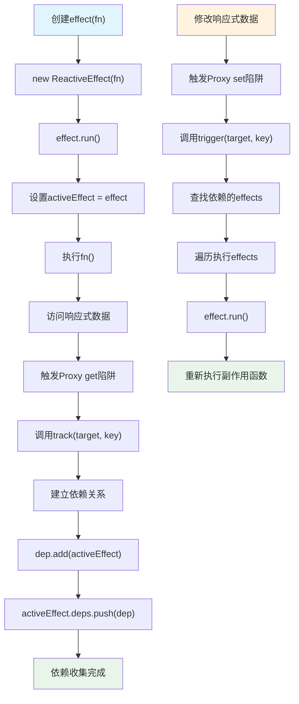
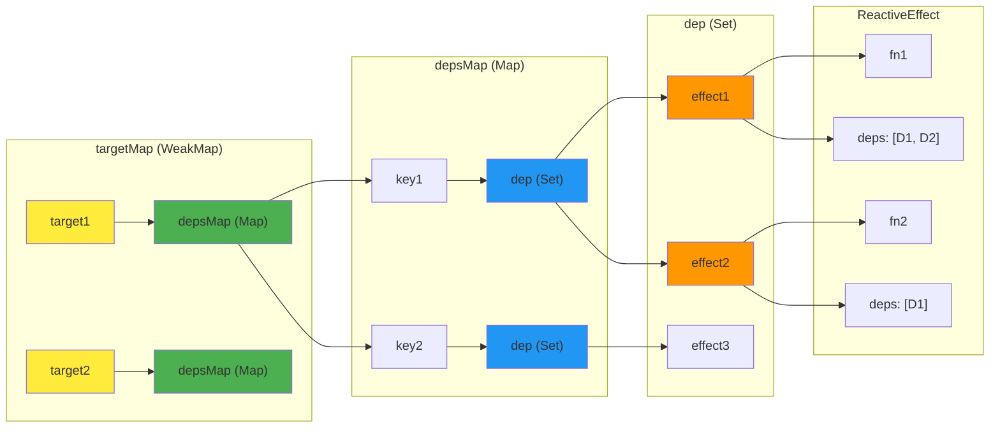
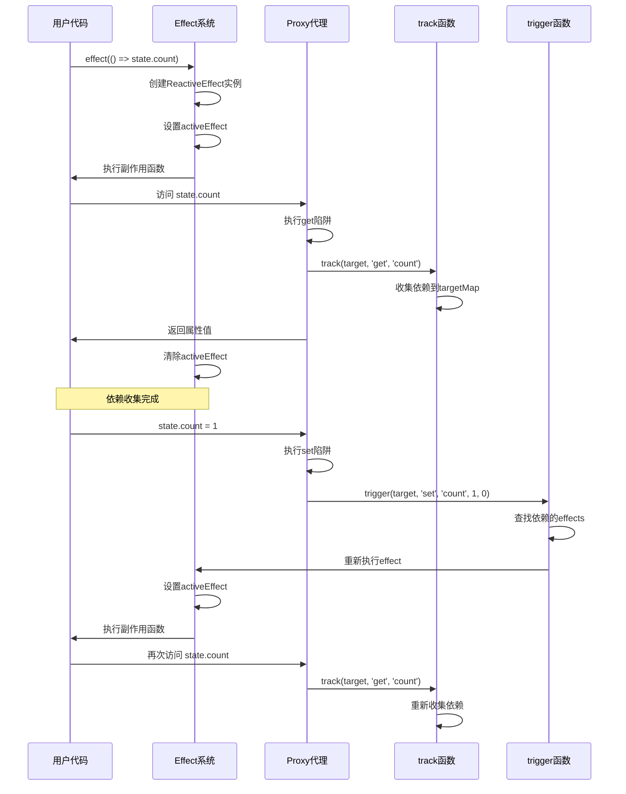
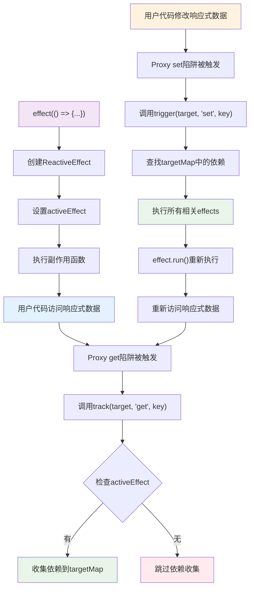

# 第2章：响应式系统设计哲学

## 🎯 本章学习目标

- 理解响应式系统的核心设计思想
- 掌握Vue3响应式系统的设计原则
- 分析从Vue2到Vue3响应式系统的演进逻辑
- 了解响应式系统设计面临的核心挑战
- 对比不同框架的响应式系统设计理念

## 2.1 什么是响应式系统

### 2.1.1 响应式系统的本质

响应式系统的核心思想是：**当数据发生变化时，依赖这些数据的地方能够自动更新**。

```javascript
// 理想的响应式效果
let price = 10
let quantity = 2
let total = price * quantity  // total = 20

price = 20
// 期望：total 自动变为 40
console.log(total) // 希望输出 40，而不是 20
```

### 2.1.2 响应式系统的三个核心概念

**1. 依赖收集 (Dependency Collection)**
- 系统需要知道哪些地方使用了响应式数据
- 建立数据与使用者之间的关联关系

**2. 依赖触发 (Dependency Trigger)**
- 当数据变化时，通知所有依赖这个数据的地方
- 触发相应的更新操作

**3. 调度执行 (Scheduling)**
- 决定更新的时机和顺序
- 优化性能，避免不必要的重复更新

### 2.1.3 响应式系统在前端框架中的作用

```javascript
// 在Vue中的体现
export default {
  data() {
    return {
      message: 'Hello'  // 响应式数据
    }
  },
  computed: {
    upperMessage() {
      return this.message.toUpperCase()  // 依赖message
    }
  },
  template: `
    <div>{{ message }}</div>  <!-- 依赖message -->
    <div>{{ upperMessage }}</div>  <!-- 依赖upperMessage，间接依赖message -->
  `
}

// 当 this.message 变化时
// 1. 模板中的 {{ message }} 自动更新
// 2. computed 中的 upperMessage 重新计算
// 3. 模板中的 {{ upperMessage }} 也会更新
```

## 2.2 Vue2响应式系统的设计与局限

### 2.2.1 Vue2的响应式实现原理

Vue2基于`Object.defineProperty`实现响应式：

```javascript
// Vue2响应式核心实现（简化版）
function defineReactive(obj, key, val) {
  const dep = new Dep()  // 每个属性对应一个依赖收集器
  
  Object.defineProperty(obj, key, {
    enumerable: true,
    configurable: true,
    get() {
      // 依赖收集：记录谁在访问这个属性
      if (Dep.target) {
        dep.depend()
      }
      return val
    },
    set(newVal) {
      if (newVal === val) return
      val = newVal
      // 依赖触发：通知所有依赖者更新
      dep.notify()
    }
  })
}

// 使用示例
const data = {}
defineReactive(data, 'message', 'hello')

// 访问时会被拦截
console.log(data.message)  // 触发getter，进行依赖收集

// 修改时会被拦截
data.message = 'hi'  // 触发setter，通知依赖更新
```

### 2.2.2 Vue2响应式系统的设计优势

**1. 简单直观**
- API设计简洁，容易理解
- 开发者心智负担小

**2. 自动化程度高**
- 数据变化自动触发视图更新
- 无需手动管理依赖关系

**3. 性能可预测**
- 明确的依赖关系
- 精确的更新范围

### 2.2.3 Vue2响应式系统的根本局限

**1. 属性监听的不完整性**

```javascript
const data = { a: 1 }
defineReactive(data, 'a', 1)

// 问题1：无法监听新增属性
data.b = 2  // 不会被监听
console.log(data.b)  // 不会触发依赖收集

// 问题2：无法监听删除属性
delete data.a  // 不会被监听

// Vue2的解决方案：提供特殊API
Vue.set(data, 'b', 2)    // 手动设置响应式属性
Vue.delete(data, 'a')    // 手动删除响应式属性
```

**2. 数组监听的复杂性**

```javascript
const arr = [1, 2, 3]

// 问题：通过索引设置值无法被监听
arr[0] = 10  // Vue2中不会触发更新

// 问题：直接修改length无法被监听
arr.length = 0  // Vue2中不会触发更新

// Vue2的解决方案：重写数组方法
const arrayMethods = Object.create(Array.prototype)
;['push', 'pop', 'shift', 'unshift', 'splice', 'sort', 'reverse']
.forEach(method => {
  arrayMethods[method] = function(...args) {
    const result = Array.prototype[method].apply(this, args)
    // 手动触发更新
    notify()
    return result
  }
})
```

**3. 深度监听的性能问题**

```javascript
// Vue2需要递归遍历对象的所有属性
function observe(obj) {
  if (typeof obj !== 'object' || obj === null) return
  
  Object.keys(obj).forEach(key => {
    defineReactive(obj, key, obj[key])
    // 如果值是对象，递归处理
    if (typeof obj[key] === 'object') {
      observe(obj[key])  // 深度遍历
    }
  })
}

// 问题：初始化时性能开销大
const largeObject = {
  level1: {
    level2: {
      level3: {
        // ... 深层嵌套对象
        data: new Array(1000).fill(0).map((_, i) => ({ id: i }))
      }
    }
  }
}
observe(largeObject)  // 需要遍历所有层级的所有属性
```

## 2.3 Vue3响应式系统的设计哲学

### 2.3.1 核心设计目标

Vue3响应式系统的设计遵循以下核心目标：

**1. 完整性 (Completeness)**
- 能够监听对象的所有操作
- 不再有监听盲区

**2. 性能 (Performance)**
- 初始化性能优化
- 运行时性能提升

**3. 独立性 (Independence)**
- 可以脱离Vue框架独立使用
- 清晰的API边界

**4. 类型友好 (Type-friendly)**
- 完整的TypeScript支持
- 更好的开发体验

### 2.3.2 Proxy：天然的完整拦截器

Vue3选择Proxy作为响应式系统的基础，原因如下：

```javascript
// Proxy可以拦截对象的所有操作
const handler = {
  // 属性访问
  get(target, key, receiver) {
    console.log(`访问属性: ${key}`)
    return Reflect.get(target, key, receiver)
  },
  
  // 属性设置（包括新增）
  set(target, key, value, receiver) {
    console.log(`设置属性: ${key} = ${value}`)
    return Reflect.set(target, key, value, receiver)
  },
  
  // 属性删除
  deleteProperty(target, key) {
    console.log(`删除属性: ${key}`)
    return Reflect.deleteProperty(target, key)
  },
  
  // 遍历属性
  ownKeys(target) {
    console.log('遍历属性')
    return Reflect.ownKeys(target)
  },
  
  // 检查属性存在
  has(target, key) {
    console.log(`检查属性存在: ${key}`)
    return Reflect.has(target, key)
  }
}

const obj = new Proxy({}, handler)

// 所有操作都能被拦截
obj.a = 1        // 设置属性: a = 1
console.log(obj.a)  // 访问属性: a
delete obj.a     // 删除属性: a
'a' in obj       // 检查属性存在: a
Object.keys(obj) // 遍历属性
```

### 2.3.3 惰性响应式 (Lazy Reactivity)

Vue3采用惰性响应式策略，提升初始化性能：

```javascript
// Vue2：立即深度遍历
function vue2Reactive(obj) {
  // 立即处理所有嵌套属性
  Object.keys(obj).forEach(key => {
    defineReactive(obj, key, obj[key])
    if (isObject(obj[key])) {
      vue2Reactive(obj[key])  // 立即递归
    }
  })
}

// Vue3：按需处理
function vue3Reactive(target) {
  return new Proxy(target, {
    get(target, key, receiver) {
      const result = Reflect.get(target, key, receiver)
      
      // 只有在访问时才将嵌套对象转为响应式
      if (isObject(result)) {
        return reactive(result)  // 惰性处理
      }
      
      return result
    }
  })
}

// 性能对比示例
const deepObject = {
  level1: { level2: { level3: { data: 'value' } } }
}

// Vue2：创建时就处理所有层级
const vue2Data = vue2Reactive(deepObject)  // 立即处理3层

// Vue3：只在访问时处理
const vue3Data = vue3Reactive(deepObject)  // 只处理第1层
// 只有访问 vue3Data.level1.level2.level3 时才处理嵌套层级
```

### 2.3.4 不可变性与可变性的平衡

Vue3响应式系统在保持API简单的同时，提供了更多控制选项：

```javascript
import { reactive, readonly, shallowReactive, shallowReadonly } from 'vue'

const original = { nested: { count: 0 } }

// 深度响应式：默认行为
const reactiveData = reactive(original)
reactiveData.nested.count++  // 会触发更新

// 只读响应式：防止意外修改
const readonlyData = readonly(original)
readonlyData.nested.count++  // 开发环境会警告

// 浅层响应式：性能优化
const shallowData = shallowReactive(original)
shallowData.nested = { count: 1 }  // 会触发更新
shallowData.nested.count++  // 不会触发更新

// 浅层只读：组合使用
const shallowReadonlyData = shallowReadonly(original)
```

## 2.4 响应式系统的架构设计

### 2.4.1 分层架构

Vue3响应式系统采用清晰的分层架构：

```
┌─────────────────────────────────┐
│        Application Layer        │  Vue组件、computed、watch等
├─────────────────────────────────┤
│        Reactivity API          │  reactive、ref、computed等
├─────────────────────────────────┤
│        Effect System           │  effect、依赖收集、触发更新
├─────────────────────────────────┤
│        Proxy Handler           │  get、set、deleteProperty等
├─────────────────────────────────┤
│        Core Utilities          │  工具函数、类型判断等
└─────────────────────────────────┘
```

### 2.4.2 依赖收集系统的设计

```javascript
// 全局依赖收集状态
const effectStack = []  // effect执行栈，支持嵌套effect
let activeEffect = null // 当前正在执行的effect
const targetMap = new WeakMap() // 存储依赖关系的全局映射

// Effect类：封装副作用函数
class ReactiveEffect {
  constructor(fn, scheduler = null) {
    this.fn = fn
    this.scheduler = scheduler
    this.deps = []  // 存储依赖此effect的dep集合
    this.active = true
  }
  
  run() {
    if (!this.active) {
      return this.fn()
    }
    
    // 清理之前的依赖
    cleanupEffect(this)
    
    try {
      // 设置当前活跃effect
      effectStack.push(this)
      activeEffect = this
      
      // 执行副作用函数，期间会触发依赖收集
      return this.fn()
    } finally {
      // 恢复之前的activeEffect
      effectStack.pop()
      activeEffect = effectStack[effectStack.length - 1] || null
    }
  }
  
  stop() {
    if (this.active) {
      cleanupEffect(this)
      this.active = false
    }
  }
}

// 创建effect的工厂函数
function effect(fn, options = {}) {
  const _effect = new ReactiveEffect(fn, options.scheduler)
  
  // 立即执行一次，建立依赖关系
  _effect.run()
  
  // 返回runner函数，可以手动重新执行
  const runner = _effect.run.bind(_effect)
  runner.effect = _effect
  return runner
}

// 清理effect的所有依赖
function cleanupEffect(effect) {
  const { deps } = effect
  if (deps.length) {
    for (let i = 0; i < deps.length; i++) {
      deps[i].delete(effect)
    }
    deps.length = 0
  }
}

// 依赖收集的核心实现
function track(target, type, key) {
  // 如果没有正在执行的effect，不收集依赖
  if (!activeEffect) return
  
  // 获取target对应的依赖映射表
  let depsMap = targetMap.get(target)
  if (!depsMap) {
    targetMap.set(target, (depsMap = new Map()))
  }
  
  // 获取key对应的依赖集合
  let dep = depsMap.get(key)
  if (!dep) {
    depsMap.set(key, (dep = new Set()))
  }
  
  // 建立双向依赖关系
  if (!dep.has(activeEffect)) {
    dep.add(activeEffect)           // dep收集effect
    activeEffect.deps.push(dep)     // effect记录dep
  }
}

// 依赖触发系统的设计
function trigger(target, type, key, newValue, oldValue) {
  const depsMap = targetMap.get(target)
  if (!depsMap) return
  
  const effects = new Set()
  
  // 收集需要触发的effect
  if (key !== void 0) {
    const dep = depsMap.get(key)
    if (dep) {
      dep.forEach(effect => {
        // 避免无限循环：不触发当前正在执行的effect
        if (effect !== activeEffect) {
          effects.add(effect)
        }
      })
    }
  }
  
  // 执行所有收集到的effect
  effects.forEach(effect => {
    if (effect.scheduler) {
      // 如果有调度器，使用调度器执行
      effect.scheduler(effect)
    } else {
      // 否则直接执行
      effect.run()
    }
  })
}

// reactive函数实现
function reactive(target) {
  if (typeof target !== 'object' || target === null) {
    return target
  }
  
  return new Proxy(target, {
    get(target, key, receiver) {
      // 获取属性值
      const result = Reflect.get(target, key, receiver)
      
      // 依赖收集：在这里调用track
      track(target, 'get', key)
      
      // 如果值是对象，递归代理（惰性）
      if (typeof result === 'object' && result !== null) {
        return reactive(result)
      }
      
      return result
    },
    
    set(target, key, value, receiver) {
      // 获取旧值
      const oldValue = target[key]
      
      // 设置新值
      const result = Reflect.set(target, key, value, receiver)
      
      // 依赖触发：在这里调用trigger
      if (oldValue !== value) {
        trigger(target, 'set', key, value, oldValue)
      }
      
      return result
    },
    
    deleteProperty(target, key) {
      const hadKey = hasOwn(target, key)
      const oldValue = target[key]
      const result = Reflect.deleteProperty(target, key)
      
      if (result && hadKey) {
        trigger(target, 'delete', key, undefined, oldValue)
      }
      
      return result
    }
  })
}

// 工具函数
function hasOwn(target, key) {
  return Object.prototype.hasOwnProperty.call(target, key)
}

// 使用示例
const state = reactive({ count: 0, name: 'Vue' })

// 创建effect，会立即执行并建立依赖关系
const runner = effect(() => {
  console.log(`${state.name}: ${state.count}`)  // 读取时触发track
})

// 修改数据，触发effect重新执行
state.count++  // 写入时触发trigger，effect重新执行
```

### 2.4.3 依赖收集与触发流程图

**依赖收集与触发完整流程：**



**数据结构关系图：**



**track触发时机详解：**

`track`函数在以下时机被调用：

1. **Proxy的get陷阱中**：当访问响应式对象的属性时
2. **必须有activeEffect**：只有在effect执行期间才收集依赖
3. **每次属性访问都会调用**：包括计算属性、watch、组件渲染等



**具体执行示例：**

```javascript
// 示例：展示完整的依赖收集和触发过程
const state = reactive({ count: 0, name: 'Vue' })

// 1. 创建第一个effect
const effect1 = effect(() => {
  console.log('Effect1:', state.count)  // 依赖 state.count
})

// 2. 创建第二个effect  
const effect2 = effect(() => {
  console.log('Effect2:', state.count + state.name)  // 依赖 state.count 和 state.name
})

// 此时依赖关系：
// targetMap.get(state).get('count') = Set([effect1, effect2])
// targetMap.get(state).get('name') = Set([effect2])

// 3. 修改count，会触发effect1和effect2
state.count = 1

// 4. 修改name，只会触发effect2
state.name = 'Vue3'

// 5. 演示track的具体触发时机
console.log('=== track触发时机演示 ===')

// 当没有activeEffect时，track不会执行
console.log('直接访问属性（无effect）:')
console.log(state.count) // 触发get陷阱，但track函数中会直接return

// 当有activeEffect时，track才会收集依赖
console.log('在effect中访问属性:')
effect(() => {
  console.log('Effect执行中，访问state.count')
  const value = state.count // 这里会触发track收集依赖
  console.log('获取到值:', value)
})

// 6. track触发时机总结
console.log('=== track触发时机总结 ===')
/*
track函数的触发时机：
1. 必须在Proxy的get陷阱中调用
2. 必须有activeEffect存在
3. 每次访问响应式对象属性都会调用
4. 用于建立effect与响应式数据的依赖关系
*/
```

**track触发时机完整流程图：**



**嵌套effect的处理：**

```javascript
// 嵌套effect示例
const outer = effect(() => {
  console.log('Outer effect start')
  
  const inner = effect(() => {
    console.log('Inner effect:', state.count)
  })
  
  console.log('Outer effect end')
})

// effectStack的变化过程：
// 1. [] -> [outer]           (执行outer effect)
// 2. [outer] -> [outer, inner] (执行inner effect)  
// 3. [outer, inner] -> [outer]  (inner执行完毕)
// 4. [outer] -> []              (outer执行完毕)
```

### 2.4.4 调度系统的设计

Vue3的调度系统负责优化更新时机：

```javascript
// 任务队列管理
const queue = []
let isFlushing = false
let isFlushPending = false

function queueJob(job) {
  // 避免重复添加
  if (!queue.includes(job)) {
    queue.push(job)
  }
  
  // 异步刷新队列
  if (!isFlushPending) {
    isFlushPending = true
    nextTick(flushJobs)
  }
}

function flushJobs() {
  isFlushPending = false
  isFlushing = true
  
  // 按照优先级排序
  queue.sort((a, b) => a.id - b.id)
  
  // 执行所有任务
  try {
    queue.forEach(job => job())
  } finally {
    queue.length = 0
    isFlushing = false
  }
}
```

## 2.5 设计哲学的体现

### 2.5.1 渐进式增强

Vue3响应式系统体现了渐进式增强的设计哲学：

```javascript
// 基础使用：简单直观
const state = reactive({ count: 0 })
state.count++

// 进阶使用：更多控制
const state = reactive({ count: 0 })
const readonlyState = readonly(state)
const shallowState = shallowReactive({ nested: {} })

// 高级使用：完全控制
import { effect, stop, track, trigger } from '@vue/reactivity'

const runner = effect(() => {
  console.log(state.count)
}, {
  scheduler: (job) => {
    // 自定义调度逻辑
    setTimeout(job, 100)
  }
})

// 停止响应
stop(runner)
```

### 2.5.2 显式优于隐式

Vue3在保持简单API的同时，提供了更多显式控制：

```javascript
// ref：显式的值包装
const count = ref(0)
console.log(count.value)  // 显式访问.value

// computed：显式的依赖计算
const doubled = computed(() => count.value * 2)

// watch：显式的依赖监听
watch(count, (newVal, oldVal) => {
  console.log(`${oldVal} -> ${newVal}`)
})

// effect：显式的副作用
effect(() => {
  document.title = `Count: ${count.value}`
})
```

### 2.5.3 组合优于继承

Vue3响应式系统通过组合实现复杂功能：

```javascript
// 组合多个响应式原语
function useCounter(initialValue = 0) {
  const count = ref(initialValue)
  const doubled = computed(() => count.value * 2)
  
  const increment = () => count.value++
  const decrement = () => count.value--
  
  // 组合监听器
  watchEffect(() => {
    if (count.value > 10) {
      console.log('Count is getting high!')
    }
  })
  
  return {
    count,
    doubled,
    increment,
    decrement
  }
}

// 使用组合
const { count, doubled, increment } = useCounter(5)
```

## 2.6 与其他框架的对比

### 2.6.1 与React的对比

```javascript
// React：显式状态管理
function Counter() {
  const [count, setCount] = useState(0)
  const doubled = useMemo(() => count * 2, [count])
  
  useEffect(() => {
    document.title = `Count: ${count}`
  }, [count])
  
  return (
    <div>
      <p>{count}</p>
      <p>{doubled}</p>
      <button onClick={() => setCount(count + 1)}>+</button>
    </div>
  )
}

// Vue3：隐式响应式
const Counter = {
  setup() {
    const count = ref(0)
    const doubled = computed(() => count.value * 2)
    
    watchEffect(() => {
      document.title = `Count: ${count.value}`
    })
    
    return { count, doubled }
  },
  template: `
    <div>
      <p>{{ count }}</p>
      <p>{{ doubled }}</p>
      <button @click="count++">+</button>
    </div>
  `
}
```

### 2.6.2 与MobX的对比

```javascript
// MobX：基于装饰器的响应式
class Store {
  @observable count = 0
  
  @computed get doubled() {
    return this.count * 2
  }
  
  @action increment() {
    this.count++
  }
}

// Vue3：基于函数的响应式
function useStore() {
  const count = ref(0)
  const doubled = computed(() => count.value * 2)
  const increment = () => count.value++
  
  return { count, doubled, increment }
}
```

## 2.7 设计决策的权衡

### 2.7.1 性能 vs 功能

**Vue3的选择：在保证功能完整性的前提下优化性能**

```javascript
// 功能完整性：支持所有操作
const state = reactive({ list: [] })
state.list.push(item)        // ✅ 支持
state.list[0] = newItem      // ✅ 支持
delete state.list[0]         // ✅ 支持
state.newProp = value        // ✅ 支持

// 性能优化：惰性处理
const state = reactive({
  shallow: { count: 0 },
  deep: { level1: { level2: { level3: {} } } }
})
// 只有访问时才处理深层对象
```

### 2.7.2 简单 vs 灵活

**Vue3的选择：提供简单的默认行为，同时保留灵活性**

```javascript
// 简单的默认行为
const state = reactive({ count: 0 })  // 深度响应式

// 灵活的高级选项
const state = shallowReactive({ count: 0 })  // 浅层响应式
const state = readonly(original)              // 只读
const state = markRaw(original)               // 跳过响应式
```

## 2.8 本章小结

### 2.8.1 核心要点回顾

1. **响应式系统的本质**：建立数据与依赖之间的自动关联
2. **Vue2的局限性**：Object.defineProperty的先天不足
3. **Vue3的设计目标**：完整性、性能、独立性、类型友好
4. **Proxy的优势**：完整的操作拦截能力
5. **惰性响应式**：按需处理，提升性能
6. **架构设计**：清晰的分层和职责划分

### 2.8.2 设计哲学总结

Vue3响应式系统的设计哲学可以概括为：
- **渐进式增强**：从简单到复杂的平滑过渡
- **显式优于隐式**：在简单性和可控性之间找到平衡
- **组合优于继承**：通过组合实现复杂功能
- **性能与功能并重**：不为了性能牺牲功能完整性

### 2.8.3 下一步学习指导

理解了响应式系统的设计哲学后，接下来我们将：
1. **第3章：Proxy与Reflect基础** - 深入理解Vue3响应式的技术基础
2. **第4章：响应式核心实现** - 学习具体的实现细节
3. **第5章：副作用系统** - 掌握依赖收集和触发机制

---

**思考题**：
1. 为什么Vue3不选择像React那样的显式状态管理方式？
2. 在什么场景下你会选择shallowReactive而不是reactive？
3. Vue3的响应式系统如何在保持简单API的同时提供强大功能？

**下一章预告**：我们将深入学习Proxy和Reflect的技术细节，理解Vue3响应式系统的技术基石。 