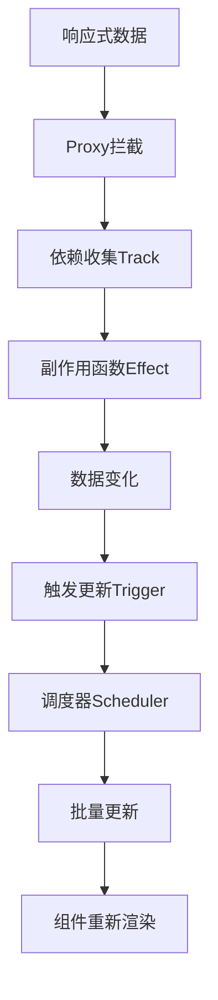

# 第4章：响应式核心实现

## 🎯 本章学习目标

- 深入理解Vue3响应式系统的整体架构
- 掌握reactive、ref、computed等核心API的实现原理
- 理解依赖收集和触发机制的详细流程
- 学习响应式系统的调度和批量更新机制
- 了解响应式系统的边界情况和优化策略
- 能够手写一个完整的响应式系统

## 4.1 响应式系统整体架构

### 4.1.1 核心模块概览

Vue3的响应式系统主要由以下几个核心模块组成：

```
@vue/reactivity
├── reactive.ts        # reactive API 实现
├── ref.ts             # ref API 实现  
├── computed.ts        # computed API 实现
├── effect.ts          # 副作用系统
├── baseHandlers.ts    # 基础类型的Proxy处理器
├── collectionHandlers.ts # 集合类型的Proxy处理器
├── operations.ts      # 操作类型定义
└── dep.ts            # 依赖管理
```

### 4.1.2 数据流架构



### 4.1.3 关键数据结构

```javascript
// 全局依赖映射：WeakMap<target, Map<key, Set<ReactiveEffect>>>
const targetMap = new WeakMap()

// 响应式标记
const enum ReactiveFlags {
  SKIP = '__v_skip',
  IS_REACTIVE = '__v_isReactive',
  IS_READONLY = '__v_isReadonly',
  IS_SHALLOW = '__v_isShallow',
  RAW = '__v_raw'
}

// 操作类型
const enum TrackOpTypes {
  GET = 'get',
  HAS = 'has',
  ITERATE = 'iterate'
}

const enum TriggerOpTypes {
  SET = 'set',
  ADD = 'add',
  DELETE = 'delete',
  CLEAR = 'clear'
}
```

## 4.2 副作用系统（Effect System）

### 4.2.1 ReactiveEffect类

```javascript
// 当前活跃的副作用
let activeEffect = undefined
// 副作用栈，处理嵌套effect
const effectStack = []

class ReactiveEffect {
  constructor(
    fn,                    // 副作用函数
    scheduler = null,      // 调度器
    scope                  // 作用域
  ) {
    this.fn = fn
    this.scheduler = scheduler
    this.active = true     // 是否激活
    this.deps = []         // 依赖列表
    this.parent = undefined // 父effect，处理嵌套
    
    // 记录作用域
    if (scope && scope.active) {
      scope.effects.push(this)
    }
  }
  
  run() {
    // 如果已经停用，直接执行函数
    if (!this.active) {
      return this.fn()
    }
    
    let parent = activeEffect
    let lastShouldTrack = shouldTrack
    
    try {
      // 设置父effect，处理嵌套情况
      this.parent = parent
      activeEffect = this
      shouldTrack = true
      
      // 清理之前的依赖
      cleanupEffect(this)
      
      // 执行副作用函数
      return this.fn()
    } finally {
      // 恢复之前的状态
      activeEffect = parent
      shouldTrack = lastShouldTrack
      this.parent = undefined
    }
  }
  
  stop() {
    if (this.active) {
      cleanupEffect(this)
      this.active = false
    }
  }
}

// 清理effect的所有依赖
function cleanupEffect(effect) {
  const { deps } = effect
  if (deps.length) {
    for (let i = 0; i < deps.length; i++) {
      deps[i].delete(effect)
    }
    deps.length = 0
  }
}
```

### 4.2.2 effect API实现

```javascript
function effect(fn, options = {}) {
  // 如果fn已经是effect，获取原始函数
  if (fn.effect) {
    fn = fn.effect.fn
  }
  
  const _effect = new ReactiveEffect(fn, options.scheduler)
  
  // 合并选项
  if (options) {
    extend(_effect, options)
  }
  
  // 立即执行一次
  if (!options.lazy) {
    _effect.run()
  }
  
  // 返回runner函数
  const runner = _effect.run.bind(_effect)
  runner.effect = _effect
  return runner
}

// 停止effect
function stop(runner) {
  runner.effect.stop()
}
```

### 4.2.3 依赖收集（Track）

```javascript
// 是否应该收集依赖
let shouldTrack = true

function track(target, type, key) {
  // 没有活跃effect或不应该收集依赖时，直接返回
  if (shouldTrack && activeEffect) {
    // 获取target对应的依赖映射
    let depsMap = targetMap.get(target)
    if (!depsMap) {
      targetMap.set(target, (depsMap = new Map()))
    }
    
    // 获取key对应的依赖集合
    let dep = depsMap.get(key)
    if (!dep) {
      depsMap.set(key, (dep = createDep()))
    }
    
    // 收集依赖
    trackEffects(dep)
  }
}

function trackEffects(dep) {
  let shouldTrack = false
  
  // 检查是否需要收集
  if (!dep.has(activeEffect)) {
    dep.add(activeEffect)
    activeEffect.deps.push(dep)
    shouldTrack = true
  }
  
  return shouldTrack
}

// 创建依赖集合
function createDep(effects) {
  const dep = new Set(effects)
  dep.w = 0 // was tracked
  dep.n = 0 // newly tracked
  return dep
}
```

### 4.2.4 触发更新（Trigger）

```javascript
function trigger(target, type, key, newValue, oldValue, oldTarget) {
  // 获取target的依赖映射
  const depsMap = targetMap.get(target)
  if (!depsMap) {
    return
  }
  
  let deps = []
  
  // 根据操作类型收集需要触发的依赖
  if (type === TriggerOpTypes.CLEAR) {
    // 清空操作，触发所有依赖
    deps = [...depsMap.values()]
  } else if (key === 'length' && isArray(target)) {
    // 数组长度变化的特殊处理
    depsMap.forEach((dep, key) => {
      if (key === 'length' || key >= newValue) {
        deps.push(dep)
      }
    })
  } else {
    // 普通属性变化
    if (key !== void 0) {
      deps.push(depsMap.get(key))
    }
    
    // 新增属性的处理
    switch (type) {
      case TriggerOpTypes.ADD:
        if (!isArray(target)) {
          deps.push(depsMap.get(ITERATE_KEY))
        } else if (isIntegerKey(key)) {
          deps.push(depsMap.get('length'))
        }
        break
      case TriggerOpTypes.DELETE:
        if (!isArray(target)) {
          deps.push(depsMap.get(ITERATE_KEY))
        }
        break
      case TriggerOpTypes.SET:
        break
    }
  }
  
  // 触发所有相关的effect
  if (deps.length === 1) {
    if (deps[0]) {
      triggerEffects(deps[0])
    }
  } else {
    const effects = []
    for (const dep of deps) {
      if (dep) {
        effects.push(...dep)
      }
    }
    triggerEffects(createDep(effects))
  }
}

function triggerEffects(dep) {
  // 将Set转换为数组，避免在迭代过程中修改Set
  const effects = isArray(dep) ? dep : [...dep]
  
  // 先触发computed的effect
  // fix: https://github.com/vuejs/core/issues/5720
  // 在某个effect中，如果computed effect和普通effect同时存在，如果普通effect先触发，那么此时获取的computed值为旧值，不符合预期
  for (const effect of effects) {
    if (effect.computed) {
      triggerEffect(effect)
    }
  }
  
  // 再触发普通的effect
  for (const effect of effects) {
    if (!effect.computed) {
      triggerEffect(effect)
    }
  }
}

function triggerEffect(effect) {
  if (effect !== activeEffect || effect.allowRecurse) {
    if (effect.scheduler) {
      // 有调度器，使用调度器执行
      effect.scheduler()
    } else {
      // 直接执行
      effect.run()
    }
  }
}
```

## 4.3 reactive API实现

### 4.3.1 reactive函数

```javascript
// 响应式对象缓存
const reactiveMap = new WeakMap()
const shallowReactiveMap = new WeakMap()
const readonlyMap = new WeakMap()
const shallowReadonlyMap = new WeakMap()

function reactive(target) {
  // 如果已经是只读对象，直接返回
  if (isReadonly(target)) {
    return target
  }
  return createReactiveObject(
    target,
    false,         // isReadonly
    mutableHandlers,
    mutableCollectionHandlers,
    reactiveMap
  )
}

function shallowReactive(target) {
  return createReactiveObject(
    target,
    false,
    shallowReactiveHandlers,
    shallowCollectionHandlers,
    shallowReactiveMap
  )
}

function readonly(target) {
  return createReactiveObject(
    target,
    true,          // isReadonly
    readonlyHandlers,
    readonlyCollectionHandlers,
    readonlyMap
  )
}

function shallowReadonly(target) {
  return createReactiveObject(
    target,
    true,
    shallowReadonlyHandlers,
    shallowReadonlyCollectionHandlers,
    shallowReadonlyMap
  )
}
```

### 4.3.2 createReactiveObject核心函数

```javascript
function createReactiveObject(
  target,
  isReadonly,
  baseHandlers,
  collectionHandlers,
  proxyMap
) {
  // 只能代理对象
  if (!isObject(target)) {
    return target
  }
  
  // 如果已经是Proxy对象，直接返回
  // 除非是readonly(reactive(obj))这种情况
  if (
    target[ReactiveFlags.RAW] &&
    !(isReadonly && target[ReactiveFlags.IS_REACTIVE])
  ) {
    return target
  }
  
  // 检查缓存
  const existingProxy = proxyMap.get(target)
  if (existingProxy) {
    return existingProxy
  }
  
  // 检查目标对象是否可以被代理
  const targetType = getTargetType(target)
  if (targetType === TargetType.INVALID) {
    return target
  }
  
  // 创建代理
  const proxy = new Proxy(
    target,
    targetType === TargetType.COLLECTION ? collectionHandlers : baseHandlers
  )
  
  // 缓存代理对象
  proxyMap.set(target, proxy)
  return proxy
}

// 目标类型枚举
const enum TargetType {
  INVALID = 0,
  COMMON = 1,
  COLLECTION = 2
}

function getTargetType(value) {
  return value[ReactiveFlags.SKIP] || !Object.isExtensible(value)
    ? TargetType.INVALID
    : targetTypeMap(toRawType(value))
}

function targetTypeMap(rawType) {
  switch (rawType) {
    case 'Object':
    case 'Array':
      return TargetType.COMMON
    case 'Map':
    case 'Set':
    case 'WeakMap':
    case 'WeakSet':
      return TargetType.COLLECTION
    default:
      return TargetType.INVALID
  }
}
```

### 4.3.3 基础类型处理器（baseHandlers）

```javascript
const mutableHandlers = {
  get: createGetter(),
  set: createSetter(),
  deleteProperty: deletePropertyHandler,
  has: hasHandler,
  ownKeys: ownKeysHandler
}

const readonlyHandlers = {
  get: createGetter(true),
  set: readonlySetHandler,
  deleteProperty: readonlyDeleteHandler
}

const shallowReactiveHandlers = {
  get: createGetter(false, true),
  set: createSetter(true),
  deleteProperty: deletePropertyHandler,
  has: hasHandler,
  ownKeys: ownKeysHandler
}

function createGetter(isReadonly = false, shallow = false) {
  return function get(target, key, receiver) {
    // 处理特殊的响应式标记
    if (key === ReactiveFlags.IS_REACTIVE) {
      return !isReadonly
    } else if (key === ReactiveFlags.IS_READONLY) {
      return isReadonly
    } else if (key === ReactiveFlags.IS_SHALLOW) {
      return shallow
    } else if (
      key === ReactiveFlags.RAW &&
      receiver === (isReadonly 
        ? shallow 
          ? shallowReadonlyMap 
          : readonlyMap
        : shallow 
          ? shallowReactiveMap 
          : reactiveMap
      ).get(target)
    ) {
      return target
    }
    
    const targetIsArray = isArray(target)
    
    // 处理数组的特殊方法
    if (!isReadonly && targetIsArray && hasOwn(arrayInstrumentations, key)) {
      return Reflect.get(arrayInstrumentations, key, receiver)
    }
    
    const res = Reflect.get(target, key, receiver)
    
    // Symbol key 或 不可追踪的key，不进行依赖收集
    if (isSymbol(key) ? builtInSymbols.has(key) : isNonTrackableKeys(key)) {
      return res
    }
    
    // 依赖收集
    if (!isReadonly) {
      track(target, TrackOpTypes.GET, key)
    }
    
    // 浅层响应式直接返回
    if (shallow) {
      return res
    }
    
    // 如果是ref，自动解包
    if (isRef(res)) {
      // 数组和整数key不自动解包
      return targetIsArray && isIntegerKey(key) ? res : res.value
    }
    
    // 如果是对象，递归创建响应式
    if (isObject(res)) {
      return isReadonly ? readonly(res) : reactive(res)
    }
    
    return res
  }
}

function createSetter(shallow = false) {
  return function set(target, key, value, receiver) {
    let oldValue = target[key]
    
    // 处理readonly的ref
    if (isReadonly(oldValue) && isRef(oldValue) && !isRef(value)) {
      return false
    }
    
    // 浅层模式不需要转换value
    if (!shallow) {
      // 获取原始值
      if (!isShallow(value) && !isReadonly(value)) {
        oldValue = toRaw(oldValue)
        value = toRaw(value)
      }
      
      // 如果target不是数组，且oldValue是ref，value不是ref
      if (!isArray(target) && isRef(oldValue) && !isRef(value)) {
        oldValue.value = value
        return true
      }
    }
    
    const hadKey = isArray(target) && isIntegerKey(key) 
      ? Number(key) < target.length 
      : hasOwn(target, key)
    
    const result = Reflect.set(target, key, value, receiver)
    
    // 如果target是原型链上的对象，不触发更新
    if (target === toRaw(receiver)) {
      if (!hadKey) {
        trigger(target, TriggerOpTypes.ADD, key, value)
      } else if (hasChanged(value, oldValue)) {
        trigger(target, TriggerOpTypes.SET, key, value, oldValue)
      }
    }
    
    return result
  }
}

function deletePropertyHandler(target, key) {
  const hadKey = hasOwn(target, key)
  const oldValue = target[key]
  const result = Reflect.deleteProperty(target, key)
  
  if (result && hadKey) {
    trigger(target, TriggerOpTypes.DELETE, key, undefined, oldValue)
  }
  
  return result
}

function hasHandler(target, key) {
  const result = Reflect.has(target, key)
  
  if (!isSymbol(key) || !builtInSymbols.has(key)) {
    track(target, TrackOpTypes.HAS, key)
  }
  
  return result
}

function ownKeysHandler(target) {
  track(target, TrackOpTypes.ITERATE, isArray(target) ? 'length' : ITERATE_KEY)
  return Reflect.ownKeys(target)
}
```

### 4.3.4 数组特殊处理

```javascript
const arrayInstrumentations = createArrayInstrumentations()

function createArrayInstrumentations() {
  const instrumentations = {}
  
  // 重写数组的查找方法
  ;['includes', 'indexOf', 'lastIndexOf'].forEach(key => {
    instrumentations[key] = function(...args) {
      const arr = toRaw(this)
      
      // 收集数组所有元素的依赖
      for (let i = 0, l = this.length; i < l; i++) {
        track(arr, TrackOpTypes.GET, i + '')
      }
      
      // 先用原始值搜索
      const res = arr[key](...args)
      if (res === -1 || res === false) {
        // 如果没找到，用响应式值搜索
        return arr[key](...args.map(toRaw))
      } else {
        return res
      }
    }
  })
  
  // 重写会修改数组长度的方法
  ;['push', 'pop', 'shift', 'unshift', 'splice'].forEach(key => {
    instrumentations[key] = function(...args) {
      pauseTracking()
      const res = toRaw(this)[key].apply(this, args)
      resetTracking()
      return res
    }
  })
  
  return instrumentations
}

// 暂停和恢复依赖收集
let pauseScheduleStack = 0

function pauseTracking() {
  pauseScheduleStack++
}

function resetTracking() {
  pauseScheduleStack--
}
```

## 4.4 ref API实现

### 4.4.1 ref类实现

```javascript
class RefImpl {
  constructor(value, shallow) {
    this._shallow = shallow
    this.dep = undefined
    this.__v_isRef = true
    
    // 如果是浅层ref，直接赋值；否则转换为响应式
    this._value = shallow ? value : toReactive(value)
    this._rawValue = shallow ? value : toRaw(value)
  }
  
  get value() {
    // 依赖收集
    trackRefValue(this)
    return this._value
  }
  
  set value(newVal) {
    // 获取新值的原始值
    const useDirectValue = this._shallow || isShallow(newVal) || isReadonly(newVal)
    newVal = useDirectValue ? newVal : toRaw(newVal)
    
    // 值变化时触发更新
    if (hasChanged(newVal, this._rawValue)) {
      this._rawValue = newVal
      this._value = useDirectValue ? newVal : toReactive(newVal)
      triggerRefValue(this, newVal)
    }
  }
}

// ref函数
function ref(value) {
  return createRef(value, false)
}

function shallowRef(value) {
  return createRef(value, true)
}

function createRef(rawValue, shallow) {
  if (isRef(rawValue)) {
    return rawValue
  }
  return new RefImpl(rawValue, shallow)
}

// 工具函数
function toReactive(value) {
  return isObject(value) ? reactive(value) : value
}

function isRef(r) {
  return !!(r && r.__v_isRef === true)
}

function unref(ref) {
  return isRef(ref) ? ref.value : ref
}
```

### 4.4.2 ref的依赖收集和触发

```javascript
function trackRefValue(ref) {
  if (shouldTrack && activeEffect) {
    ref = toRaw(ref)
    trackEffects(ref.dep || (ref.dep = createDep()))
  }
}

function triggerRefValue(ref, newVal) {
  ref = toRaw(ref)
  if (ref.dep) {
    triggerEffects(ref.dep)
  }
}
```

### 4.4.3 其他ref相关API

```javascript
// toRef：将响应式对象的某个属性转换为ref
function toRef(object, key, defaultValue) {
  const val = object[key]
  return isRef(val) ? val : new ObjectRefImpl(object, key, defaultValue)
}

class ObjectRefImpl {
  constructor(object, key, defaultValue) {
    this._object = object
    this._key = key
    this._defaultValue = defaultValue
    this.__v_isRef = true
  }
  
  get value() {
    const val = this._object[this._key]
    return val === undefined ? this._defaultValue : val
  }
  
  set value(newVal) {
    this._object[this._key] = newVal
  }
}

// toRefs：将响应式对象的所有属性转换为ref
function toRefs(object) {
  const ret = isArray(object) ? new Array(object.length) : {}
  for (const key in object) {
    ret[key] = toRef(object, key)
  }
  return ret
}

// proxyRefs：自动解包ref
function proxyRefs(objectWithRefs) {
  return isReactive(objectWithRefs)
    ? objectWithRefs
    : new Proxy(objectWithRefs, shallowUnwrapHandlers)
}

const shallowUnwrapHandlers = {
  get: (target, key, receiver) => unref(Reflect.get(target, key, receiver)),
  set: (target, key, value, receiver) => {
    const oldValue = target[key]
    if (isRef(oldValue) && !isRef(value)) {
      oldValue.value = value
      return true
    } else {
      return Reflect.set(target, key, value, receiver)
    }
  }
}
```

## 4.5 computed API实现

### 4.5.1 ComputedRefImpl类

```javascript
class ComputedRefImpl {
  constructor(getter, setter, isReadonly, isSSR) {
    this._setter = setter
    this.dep = undefined
    this.__v_isRef = true
    this.__v_isReadonly = isReadonly
    
    // 创建effect
    this.effect = new ReactiveEffect(getter, () => {
      // 调度器：当依赖变化时，标记为脏值
      if (!this._dirty) {
        this._dirty = true
        triggerRefValue(this)
      }
    })
    
    this.effect.computed = this
    this.effect.active = this._cacheable = !isSSR
    this._dirty = true
  }
  
  get value() {
    // 收集computed的依赖
    const self = toRaw(this)
    trackRefValue(self)
    
    // 如果是脏值或不可缓存，重新计算
    if (self._dirty || !self._cacheable) {
      self._dirty = false
      self._value = self.effect.run()
    }
    
    return self._value
  }
  
  set value(newValue) {
    this._setter(newValue)
  }
}

// computed函数
function computed(getterOrOptions, debugOptions, isSSR = false) {
  let getter
  let setter
  
  // 处理参数
  const onlyGetter = isFunction(getterOrOptions)
  if (onlyGetter) {
    getter = getterOrOptions
    setter = NOOP
  } else {
    getter = getterOrOptions.get
    setter = getterOrOptions.set
  }
  
  // 创建computed ref
  const cRef = new ComputedRefImpl(getter, setter, onlyGetter || !setter, isSSR)
  
  return cRef
}
```

### 4.5.2 computed的特殊处理

```javascript
// computed有特殊的触发顺序，需要先于普通effect触发
function triggerEffects(dep) {
  const effects = isArray(dep) ? dep : [...dep]
  
  // 先触发computed的effect
  for (const effect of effects) {
    if (effect.computed) {
      triggerEffect(effect)
    }
  }
  
  // 再触发普通的effect
  for (const effect of effects) {
    if (!effect.computed) {
      triggerEffect(effect)
    }
  }
}
```

## 4.6 调度系统（Scheduler）

### 4.6.1 任务调度器

```javascript
// 任务队列
const queue = []
let flushIndex = 0
let isFlushing = false
let isFlushPending = false

// 预刷新队列（在组件更新前执行）
const pendingPreFlushCbs = []
let activePreFlushCbs = null
let preFlushIndex = 0

// 后刷新队列（在组件更新后执行）
const pendingPostFlushCbs = []
let activePostFlushCbs = null

// 主要的刷新函数
function queueJob(job) {
  // 去重：如果任务不在队列中或者不是当前正在执行的任务
  if (
    !queue.length ||
    !queue.includes(
      job,
      isFlushing && job.allowRecurse ? flushIndex + 1 : flushIndex
    )
  ) {
    if (job.id == null) {
      queue.push(job)
    } else {
      // 按id排序插入
      queue.splice(findInsertionIndex(job.id), 0, job)
    }
    queueFlush()
  }
}

function queueFlush() {
  if (!isFlushing && !isFlushPending) {
    isFlushPending = true
    currentFlushPromise = resolvedPromise.then(flushJobs)
  }
}

// 刷新所有任务
function flushJobs(seen) {
  isFlushPending = false
  isFlushing = true
  
  try {
    // 执行pre队列
    flushPreFlushCbs(seen)
    
    // 按id排序，确保父组件在子组件之前更新
    queue.sort(comparator)
    
    // 执行主队列
    for (flushIndex = 0; flushIndex < queue.length; flushIndex++) {
      const job = queue[flushIndex]
      if (job && job.active !== false) {
        callWithErrorHandling(job, null, ErrorCodes.SCHEDULER) // 执行job()
      }
    }
  } finally {
    flushIndex = 0
    queue.length = 0
    
    // 执行post队列
    flushPostFlushCbs(seen)
    
    isFlushing = false
    currentFlushPromise = null
    
    // 如果在执行过程中又有新的任务，递归执行
    if (queue.length || pendingPreFlushCbs.length || pendingPostFlushCbs.length) {
      flushJobs(seen)
    }
  }
}
```

### 4.6.2 watch API中的调度

```javascript
function watch(source, cb, options = {}) {
  return doWatch(source, cb, options)
}

function doWatch(source, cb, { immediate, deep, flush, onTrack, onTrigger } = {}) {
  let getter
  let forceTrigger = false
  let isMultiSource = false
  
  // 处理不同类型的source
  if (isRef(source)) {
    getter = () => source.value
    forceTrigger = isShallow(source)
  } else if (isReactive(source)) {
    getter = () => source
    deep = true
  } else if (isArray(source)) {
    isMultiSource = true
    forceTrigger = source.some(s => isReactive(s) || isShallow(s))
    getter = () => source.map(s => {
      if (isRef(s)) {
        return s.value
      } else if (isReactive(s)) {
        return traverse(s)
      } else if (isFunction(s)) {
        return callWithErrorHandling(s, instance, ErrorCodes.WATCHER_GETTER)
      }
    })
  } else if (isFunction(source)) {
    if (cb) {
      getter = () => callWithErrorHandling(source, instance, ErrorCodes.WATCHER_GETTER)
    } else {
      // watchEffect
      getter = () => {
        if (instance && instance.isUnmounted) {
          return
        }
        if (cleanup) {
          cleanup()
        }
        return callWithAsyncErrorHandling(
          source,
          instance,
          ErrorCodes.WATCHER_CALLBACK,
          [onCleanup]
        )
      }
    }
  }
  
  // 深度监听
  if (cb && deep) {
    const baseGetter = getter
    getter = () => traverse(baseGetter())
  }
  
  let cleanup
  let onCleanup = (fn) => {
    cleanup = effect.onStop = () => {
      callWithErrorHandling(fn, instance, ErrorCodes.WATCHER_CLEANUP)
    }
  }
  
  let oldValue = isMultiSource ? [] : INITIAL_WATCHER_VALUE
  
  // 任务函数
  const job = () => {
    if (!effect.active) {
      return
    }
    
    if (cb) {
      // watch(source, cb)
      const newValue = effect.run()
      if (
        deep ||
        forceTrigger ||
        (isMultiSource
          ? newValue.some((v, i) => hasChanged(v, oldValue[i]))
          : hasChanged(newValue, oldValue)) ||
        (isRef(source) && source.value === newValue && hasChanged(newValue, oldValue))
      ) {
        // 清理副作用
        if (cleanup) {
          cleanup()
        }
        callWithAsyncErrorHandling(cb, instance, ErrorCodes.WATCHER_CALLBACK, [
          newValue,
          oldValue === INITIAL_WATCHER_VALUE ? undefined : oldValue,
          onCleanup
        ])
        oldValue = newValue
      }
    } else {
      // watchEffect
      effect.run()
    }
  }
  
  // 调度器
  let scheduler
  if (flush === 'sync') {
    scheduler = job
  } else if (flush === 'post') {
    scheduler = () => queuePostRenderEffect(job, instance && instance.suspense)
  } else {
    // 'pre' 或默认
    job.pre = true
    if (instance) job.id = instance.uid
    scheduler = () => queueJob(job)
  }
  
  // 创建effect
  const effect = new ReactiveEffect(getter, scheduler)
  
  // 初始执行
  if (cb) {
    if (immediate) {
      job()
    } else {
      oldValue = effect.run()
    }
  } else if (flush === 'post') {
    queuePostRenderEffect(effect.run.bind(effect), instance && instance.suspense)
  } else {
    effect.run()
  }
  
  // 返回停止函数
  return () => {
    effect.stop()
    if (instance && instance.scope) {
      remove(instance.scope.effects, effect)
    }
  }
}
```

## 4.7 边界情况和优化

### 4.7.1 循环引用处理

```javascript
// 防止无限递归的深度遍历
function traverse(value, seen) {
  if (!isObject(value) || value[ReactiveFlags.SKIP]) {
    return value
  }
  
  seen = seen || new Set()
  if (seen.has(value)) {
    return value
  }
  seen.add(value)
  
  if (isRef(value)) {
    traverse(value.value, seen)
  } else if (isArray(value)) {
    for (let i = 0; i < value.length; i++) {
      traverse(value[i], seen)
    }
  } else if (isSet(value) || isMap(value)) {
    value.forEach((v) => {
      traverse(v, seen)
    })
  } else if (isPlainObject(value)) {
    for (const key in value) {
      traverse(value[key], seen)
    }
  }
  
  return value
}
```

### 4.7.2 内存泄漏防护

```javascript
// 使用WeakMap避免内存泄漏
const targetMap = new WeakMap()

// effect停止时清理依赖
function cleanupEffect(effect) {
  const { deps } = effect
  if (deps.length) {
    for (let i = 0; i < deps.length; i++) {
      deps[i].delete(effect)
    }
    deps.length = 0
  }
}

// 组件卸载时清理所有effect
function cleanupEffects(effects) {
  for (let i = 0; i < effects.length; i++) {
    effects[i].stop()
  }
  effects.length = 0
}
```

### 4.7.3 性能优化

```javascript
// 依赖收集优化：使用位运算标记
const enum EffectFlags {
  ACTIVE = 1,
  RUNNING = 2,
  TRACKING = 4,
  NOTIFIED = 8
}

// 批量更新优化
let isFlushing = false
let isFlushPending = false

function queueJob(job) {
  if (!isFlushing && !isFlushPending) {
    isFlushPending = true
    nextTick(flushJobs)
  }
}

// 避免重复计算
class ComputedRefImpl {
  constructor(getter, setter) {
    this._dirty = true
    this._cacheable = true
    // ...
  }
  
  get value() {
    if (this._dirty || !this._cacheable) {
      this._dirty = false
      this._value = this.effect.run()
    }
    return this._value
  }
}
```

## 4.8 完整示例：手写响应式系统

### 4.8.1 简化版实现

```javascript
// 完整的响应式系统实现
class MiniReactivity {
  constructor() {
    this.targetMap = new WeakMap()
    this.activeEffect = null
    this.effectStack = []
  }
  
  // 依赖收集
  track(target, key) {
    if (!this.activeEffect) return
    
    let depsMap = this.targetMap.get(target)
    if (!depsMap) {
      this.targetMap.set(target, (depsMap = new Map()))
    }
    
    let dep = depsMap.get(key)
    if (!dep) {
      depsMap.set(key, (dep = new Set()))
    }
    
    dep.add(this.activeEffect)
    this.activeEffect.deps.push(dep)
  }
  
  // 触发更新
  trigger(target, key) {
    const depsMap = this.targetMap.get(target)
    if (!depsMap) return
    
    const dep = depsMap.get(key)
    if (dep) {
      const effects = [...dep]
      effects.forEach(effect => {
        if (effect !== this.activeEffect) {
          if (effect.scheduler) {
            effect.scheduler()
          } else {
            effect.run()
          }
        }
      })
    }
  }
  
  // 创建响应式对象
  reactive(target) {
    return new Proxy(target, {
      get: (obj, key) => {
        const result = Reflect.get(obj, key)
        this.track(obj, key)
        
        if (typeof result === 'object' && result !== null) {
          return this.reactive(result)
        }
        
        return result
      },
      
      set: (obj, key, value) => {
        const oldValue = obj[key]
        const result = Reflect.set(obj, key, value)
        
        if (oldValue !== value) {
          this.trigger(obj, key)
        }
        
        return result
      }
    })
  }
  
  // 创建副作用
  effect(fn, options = {}) {
    const effect = {
      run: () => {
        if (this.effectStack.includes(effect)) return
        
        try {
          this.effectStack.push(effect)
          this.activeEffect = effect
          return fn()
        } finally {
          this.effectStack.pop()
          this.activeEffect = this.effectStack[this.effectStack.length - 1]
        }
      },
      deps: [],
      scheduler: options.scheduler
    }
    
    if (!options.lazy) {
      effect.run()
    }
    
    return effect
  }
  
  // 创建computed
  computed(getter) {
    let value
    let dirty = true
    
    const effect = this.effect(getter, {
      lazy: true,
      scheduler: () => {
        if (!dirty) {
          dirty = true
          this.trigger(computed, 'value')
        }
      }
    })
    
    const computed = {
      get value() {
        if (dirty) {
          value = effect.run()
          dirty = false
        }
        this.track(computed, 'value')
        return value
      }
    }
    
    return computed
  }
}

// 使用示例
const reactivity = new MiniReactivity()

const state = reactivity.reactive({
  count: 0,
  nested: { value: 1 }
})

const doubleCount = reactivity.computed(() => state.count * 2)

reactivity.effect(() => {
  console.log(`count: ${state.count}, double: ${doubleCount.value}`)
})

state.count = 1  // 输出: count: 1, double: 2
state.count = 2  // 输出: count: 2, double: 4
```

## 4.9 本章小结

### 4.9.1 核心要点回顾

1. **响应式系统架构**：effect系统 + 代理系统 + 调度系统
2. **依赖收集机制**：track函数 + WeakMap数据结构
3. **触发更新机制**：trigger函数 + 调度器
4. **API实现原理**：reactive、ref、computed的具体实现
5. **性能优化策略**：缓存、批量更新、避免重复计算

### 4.9.2 关键技术点

- **数据结构设计**：WeakMap + Map + Set的三层结构
- **effect系统**：支持嵌套、调度、清理的完整副作用系统
- **代理处理器**：针对不同类型数据的专门处理
- **调度系统**：支持同步、异步、批量更新的灵活调度
- **边界处理**：循环引用、内存泄漏、性能优化

### 4.9.3 下一步学习指导

掌握了响应式核心实现后，接下来我们将：
1. **第5章：副作用系统深入** - 学习effect的高级特性和优化
2. **第6章：响应式高级特性** - 学习watch、watchEffect等高级API
3. **第7章：渲染器基础** - 学习响应式数据如何驱动DOM更新

---

**思考题**：
1. 为什么Vue3使用WeakMap作为targetMap的数据结构？
2. computed和普通effect在触发顺序上有什么区别？为什么？
3. 如何避免effect的无限递归执行？

**下一章预告**：我们将深入学习Vue3的副作用系统，包括effect的嵌套处理、调度优化、以及与组件系统的集成。