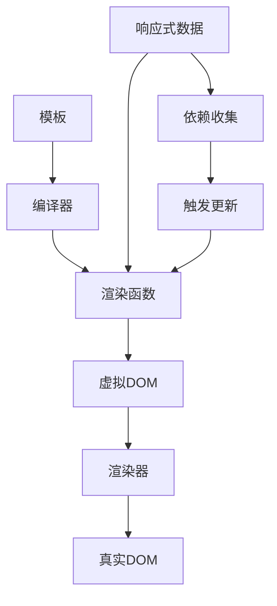

# 第5章：渲染器系统基础架构

## 5.1 渲染器的概念与作用

### 5.1.1 什么是渲染器？

渲染器（Renderer）是Vue3架构中的核心组件之一，负责将虚拟DOM转换为真实DOM并挂载到页面上。它是连接虚拟世界和真实世界的桥梁。

```javascript
// 渲染器的基本概念
const renderer = {
  render(vnode, container) {
    // 将虚拟DOM渲染到容器中
  }
}

// 使用渲染器
const vnode = h('div', { id: 'app' }, 'Hello Vue3')
renderer.render(vnode, document.querySelector('#app'))
```

### 5.1.2 渲染器在Vue3中的地位

Vue3的整体架构可以分为三大核心系统：
1. **响应式系统**：数据变化检测
2. **渲染器系统**：虚拟DOM到真实DOM的转换
3. **编译器系统**：模板到渲染函数的转换



### 5.1.3 渲染器的核心职责

1. **首次渲染（Mount）**：将虚拟DOM转换为真实DOM并挂载
2. **更新渲染（Patch）**：对比新旧虚拟DOM，更新变化部分
3. **卸载处理（Unmount）**：清理DOM和相关资源

## 5.2 渲染器的整体架构

### 5.2.1 渲染器的分层设计

Vue3的渲染器采用分层架构，实现关注点分离：

```javascript
// 渲染器架构层次
const createRenderer = (options) => {
  // 平台特定的DOM操作方法
  const {
    createElement,
    createText,
    setText,
    setElementText,
    insert,
    remove,
    patchProp
  } = options

  // 核心渲染逻辑
  const render = (vnode, container) => {
    if (vnode == null) {
      // 卸载
      if (container._vnode) {
        unmount(container._vnode)
      }
    } else {
      // 挂载或更新
      patch(container._vnode || null, vnode, container)
    }
    container._vnode = vnode
  }

  const patch = (n1, n2, container, anchor) => {
    // 核心补丁算法
  }

  return { render }
}
```

### 5.2.2 跨平台抽象

渲染器通过选项对象实现平台无关性：

```javascript
// Web平台渲染器配置
const webRendererOptions = {
  createElement(tag) {
    return document.createElement(tag)
  },
  createText(text) {
    return document.createTextNode(text)
  },
  setText(node, text) {
    node.nodeValue = text
  },
  setElementText(el, text) {
    el.textContent = text
  },
  insert(child, parent, anchor) {
    parent.insertBefore(child, anchor || null)
  },
  remove(child) {
    const parent = child.parentNode
    if (parent) {
      parent.removeChild(child)
    }
  },
  patchProp(el, key, prevValue, nextValue) {
    // 属性更新逻辑
  }
}

// 创建Web平台渲染器
const webRenderer = createRenderer(webRendererOptions)
```

## 5.3 虚拟DOM的设计

### 5.3.1 虚拟DOM的数据结构

Vue3中的虚拟DOM节点（VNode）是描述真实DOM结构的JavaScript对象：

```javascript
// VNode的基本结构
const vnode = {
  type: 'div',           // 节点类型
  props: {               // 属性和事件
    id: 'app',
    onClick: handleClick
  },
  children: [            // 子节点
    {
      type: 'span',
      children: 'Hello Vue3'
    }
  ],
  key: null,             // 用于Diff算法的标识
  ref: null,             // 引用
  el: null,              // 对应的真实DOM元素
  component: null,       // 组件实例
  shapeFlag: 0,          // 节点类型标识
  patchFlag: 0,          // 补丁标记
  dynamicProps: null,    // 动态属性
  appContext: null       // 应用上下文
}
```

### 5.3.2 ShapeFlag节点类型系统

Vue3使用位运算优化节点类型判断：

```javascript
// ShapeFlag枚举
const ShapeFlags = {
  ELEMENT: 1,                    // 1    元素节点
  FUNCTIONAL_COMPONENT: 2,       // 10   函数式组件
  STATEFUL_COMPONENT: 4,         // 100  有状态组件
  TEXT_CHILDREN: 8,              // 1000 文本子节点
  ARRAY_CHILDREN: 16,            // 10000 数组子节点
  SLOTS_CHILDREN: 32,            // 100000 插槽子节点
  TELEPORT: 64,                  // 1000000 传送门
  SUSPENSE: 128,                 // 10000000 悬念组件
  COMPONENT_SHOULD_KEEP_ALIVE: 256, // 100000000 需要保活的组件
  COMPONENT_KEPT_ALIVE: 512,     // 1000000000 已保活的组件
  COMPONENT: 6                   // 110 组件（函数式+有状态）
}

// 使用示例
function isElement(vnode) {
  return !!(vnode.shapeFlag & ShapeFlags.ELEMENT)
}

function isComponent(vnode) {
  return !!(vnode.shapeFlag & ShapeFlags.COMPONENT)
}

function hasTextChildren(vnode) {
  return !!(vnode.shapeFlag & ShapeFlags.TEXT_CHILDREN)
}
```

### 5.3.3 PatchFlag补丁优化

编译时优化，标记动态内容：

```javascript
// PatchFlag枚举
const PatchFlags = {
  TEXT: 1,              // 动态文本
  CLASS: 2,             // 动态class
  STYLE: 4,             // 动态style
  PROPS: 8,             // 动态props
  FULL_PROPS: 16,       // 具有动态key的props
  HYDRATE_EVENTS: 32,   // 具有事件监听器的元素
  STABLE_FRAGMENT: 64,  // 稳定fragment
  KEYED_FRAGMENT: 128,  // 有key的fragment
  UNKEYED_FRAGMENT: 256, // 无key的fragment
  NEED_PATCH: 512,      // 只需要非props补丁的元素
  DYNAMIC_SLOTS: 1024,  // 动态插槽
  HOISTED: -1,          // 静态提升
  BAIL: -2              // 差异化算法应该退出优化模式
}

// 模板编译示例
// <div>{{ message }}</div>
// 编译后的渲染函数
function render() {
  return createVNode("div", null, message, 1 /* TEXT */)
}
```

## 5.4 渲染器的核心工作流程

### 5.4.1 挂载过程（Mount）

首次渲染时将虚拟DOM转换为真实DOM：

```javascript
function mount(vnode, container) {
  // 1. 创建DOM元素
  const el = createElement(vnode.type)
  vnode.el = el

  // 2. 处理属性
  if (vnode.props) {
    for (const key in vnode.props) {
      patchProp(el, key, null, vnode.props[key])
    }
  }

  // 3. 处理子节点
  if (typeof vnode.children === 'string') {
    // 文本子节点
    setElementText(el, vnode.children)
  } else if (Array.isArray(vnode.children)) {
    // 数组子节点
    vnode.children.forEach(child => {
      mount(child, el)
    })
  }

  // 4. 插入到容器中
  insert(el, container)
}
```

### 5.4.2 更新过程（Patch）

对比新旧虚拟DOM，更新变化部分：

```javascript
function patch(n1, n2, container, anchor) {
  // 1. 类型不同，直接替换
  if (n1 && n1.type !== n2.type) {
    unmount(n1)
    n1 = null
  }

  const { type, shapeFlag } = n2

  switch (type) {
    case Text:
      processText(n1, n2, container, anchor)
      break
    case Comment:
      processComment(n1, n2, container, anchor)
      break
    case Fragment:
      processFragment(n1, n2, container, anchor)
      break
    default:
      if (shapeFlag & ShapeFlags.ELEMENT) {
        processElement(n1, n2, container, anchor)
      } else if (shapeFlag & ShapeFlags.COMPONENT) {
        processComponent(n1, n2, container, anchor)
      }
  }
}
```

### 5.4.3 元素处理流程

```javascript
function processElement(n1, n2, container, anchor) {
  if (n1 == null) {
    // 挂载元素
    mountElement(n2, container, anchor)
  } else {
    // 更新元素
    patchElement(n1, n2)
  }
}

function patchElement(n1, n2) {
  const el = (n2.el = n1.el)
  const oldProps = n1.props || {}
  const newProps = n2.props || {}

  // 1. 更新属性
  patchProps(el, n2, oldProps, newProps)

  // 2. 更新子节点
  patchChildren(n1, n2, el)
}

function patchProps(el, vnode, oldProps, newProps) {
  // 更新新属性
  for (const key in newProps) {
    if (oldProps[key] !== newProps[key]) {
      patchProp(el, key, oldProps[key], newProps[key])
    }
  }

  // 删除旧属性
  for (const key in oldProps) {
    if (!(key in newProps)) {
      patchProp(el, key, oldProps[key], null)
    }
  }
}
```

## 5.5 子节点更新算法

### 5.5.1 子节点的类型判断

```javascript
function patchChildren(n1, n2, container) {
  const c1 = n1 && n1.children
  const c2 = n2.children
  const prevShapeFlag = n1 ? n1.shapeFlag : 0
  const shapeFlag = n2.shapeFlag

  // 新子节点是文本
  if (shapeFlag & ShapeFlags.TEXT_CHILDREN) {
    if (prevShapeFlag & ShapeFlags.ARRAY_CHILDREN) {
      // 卸载旧的数组子节点
      unmountChildren(c1)
    }
    if (c2 !== c1) {
      setElementText(container, c2)
    }
  } else {
    // 新子节点是数组或null
    if (prevShapeFlag & ShapeFlags.ARRAY_CHILDREN) {
      if (shapeFlag & ShapeFlags.ARRAY_CHILDREN) {
        // 新旧都是数组 - 核心Diff算法
        patchKeyedChildren(c1, c2, container)
      } else {
        // 旧数组，新null - 卸载所有
        unmountChildren(c1)
      }
    } else {
      // 旧文本或null，新数组
      if (prevShapeFlag & ShapeFlags.TEXT_CHILDREN) {
        setElementText(container, '')
      }
      if (shapeFlag & ShapeFlags.ARRAY_CHILDREN) {
        mountChildren(c2, container)
      }
    }
  }
}
```

### 5.5.2 简单Diff算法预览

```javascript
function patchKeyedChildren(c1, c2, container) {
  let i = 0
  const l2 = c2.length
  let e1 = c1.length - 1
  let e2 = l2 - 1

  // 1. 从头开始比较
  while (i <= e1 && i <= e2) {
    const n1 = c1[i]
    const n2 = c2[i]
    if (isSameVNodeType(n1, n2)) {
      patch(n1, n2, container)
    } else {
      break
    }
    i++
  }

  // 2. 从尾开始比较
  while (i <= e1 && i <= e2) {
    const n1 = c1[e1]
    const n2 = c2[e2]
    if (isSameVNodeType(n1, n2)) {
      patch(n1, n2, container)
    } else {
      break
    }
    e1--
    e2--
  }

  // 3. 处理剩余情况
  if (i > e1) {
    // 新增节点
    if (i <= e2) {
      // 挂载新节点
    }
  } else if (i > e2) {
    // 删除节点
    while (i <= e1) {
      unmount(c1[i])
      i++
    }
  } else {
    // 复杂情况 - 需要进一步处理
    // 这里会涉及到最长递增子序列等高级算法
  }
}
```

## 5.6 组件渲染基础

### 5.6.1 组件实例的创建

```javascript
function createComponentInstance(vnode, parent) {
  const instance = {
    vnode,              // 组件VNode
    type: vnode.type,   // 组件对象
    parent,             // 父组件实例
    appContext: null,   // 应用上下文
    
    // 生命周期
    isMounted: false,
    isUnmounted: false,
    isDeactivated: false,
    
    // 渲染相关
    subTree: null,      // 组件的渲染结果
    next: null,         // 新的组件VNode
    update: null,       // 更新函数
    render: null,       // 渲染函数
    
    // 数据相关
    setupState: {},     // setup返回的状态
    ctx: {},           // 渲染上下文
    data: {},          // data选项的数据
    props: {},         // props
    attrs: {},         // attrs
    slots: {},         // 插槽
    
    // 其他
    refs: {},
    emit: null,
    exposed: null
  }

  instance.ctx = { _: instance }
  return instance
}
```

### 5.6.2 组件的挂载过程

```javascript
function mountComponent(initialVNode, container, anchor, parentComponent) {
  // 1. 创建组件实例
  const instance = createComponentInstance(initialVNode, parentComponent)
  
  // 2. 设置组件实例
  setupComponent(instance)
  
  // 3. 设置并运行带有副作用的渲染函数
  setupRenderEffect(instance, initialVNode, container, anchor)
}

function setupRenderEffect(instance, initialVNode, container, anchor) {
  const componentUpdateFn = () => {
    if (!instance.isMounted) {
      // 首次挂载
      const subTree = (instance.subTree = renderComponentRoot(instance))
      patch(null, subTree, container, anchor)
      initialVNode.el = subTree.el
      instance.isMounted = true
    } else {
      // 更新
      const nextTree = renderComponentRoot(instance)
      const prevTree = instance.subTree
      instance.subTree = nextTree
      patch(prevTree, nextTree, container, anchor)
    }
  }

  // 创建响应式更新函数
  const update = (instance.update = effect(componentUpdateFn, {
    scheduler: queueJob
  }))
  
  update()
}
```

## 5.7 渲染器的性能优化

### 5.7.1 静态提升（Hoisting）

编译时将静态节点提升到渲染函数外部：

```javascript
// 优化前
function render() {
  return createVNode('div', null, [
    createVNode('p', null, 'Static text'),
    createVNode('p', null, message)
  ])
}

// 优化后
const hoisted1 = createVNode('p', null, 'Static text')
function render() {
  return createVNode('div', null, [
    hoisted1,
    createVNode('p', null, message)
  ])
}
```

### 5.7.2 补丁标记优化

运行时跳过静态属性的比较：

```javascript
function patchElement(n1, n2) {
  const el = (n2.el = n1.el)
  const { patchFlag, dynamicProps } = n2

  if (patchFlag > 0) {
    // 有补丁标记，进行优化更新
    if (patchFlag & PatchFlags.CLASS) {
      // 只更新class
      if (n1.props.class !== n2.props.class) {
        el.className = n2.props.class
      }
    }
    
    if (patchFlag & PatchFlags.TEXT) {
      // 只更新文本内容
      if (n1.children !== n2.children) {
        el.textContent = n2.children
      }
    }
    
    // 其他优化...
  } else {
    // 全量比较
    patchProps(el, n2, n1.props || {}, n2.props || {})
  }
  
  patchChildren(n1, n2, el)
}
```

### 5.7.3 块级更新优化

Fragment和动态节点的收集：

```javascript
// 编译时生成的块
function render() {
  return (openBlock(), createBlock('div', null, [
    createVNode('p', null, "static"),
    createVNode('p', null, message, 1 /* TEXT */)
  ]))
}

// 块级更新只比较动态子节点
function patchBlockChildren(oldChildren, newChildren) {
  for (let i = 0; i < newChildren.length; i++) {
    patch(oldChildren[i], newChildren[i])
  }
}
```

## 5.8 总结

### 5.8.1 渲染器的核心价值

1. **抽象性**：提供平台无关的虚拟DOM操作接口
2. **高效性**：通过Diff算法最小化DOM操作
3. **可扩展性**：支持自定义渲染器和跨平台渲染
4. **优化性**：编译时和运行时的多重优化策略

### 5.8.2 与其他系统的协作

- **响应式系统**：提供数据变化的监听和触发
- **编译器系统**：提供优化信息和静态分析结果
- **组件系统**：管理组件的生命周期和状态

### 5.8.3 学习要点

1. 理解渲染器的分层架构和职责划分
2. 掌握虚拟DOM的数据结构和优化标记
3. 熟悉挂载、更新、卸载的核心流程
4. 了解性能优化的原理和实现方式

下一章我们将深入学习虚拟DOM与Diff算法的具体实现，特别是Vue3中先进的双端Diff算法和最长递增子序列优化。 